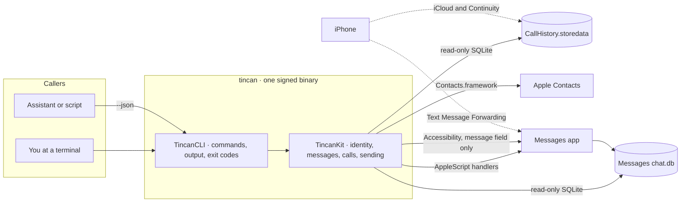

# Design and rationale

[← tincan](../README.md)

tincan began with a practical problem: an assistant asked to help with texts named the wrong person, missed half the conversation, and claimed to have sent things it hadn't. Each failure had a concrete cause:

| What went wrong | Cause | What tincan does |
| --- | --- | --- |
| The wrong person attached to a number | Guessing from partial matches, or picking one of several cards | Exact matching through Contacts; ambiguity is reported, never guessed |
| Empty or garbled message bodies | Modern Messages keeps most text only in `attributedBody`, an archived attributed string | Decodes it with Apple's own unarchiver, with a byte-level fallback |
| Mislabelled senders | Joining the wrong tables, or confusing your messages with theirs | One sender model: `me`, or an address with a name only when it is certain |
| Reactions counted as messages | Tapbacks are stored as message rows | Reactions are folded onto the message they react to |
| Half a person's history | iMessage, SMS and RCS are separate conversations, sometimes on different numbers | A person's one-to-one conversations are merged; `chat:<id>` still reads one |
| Lost Full Disk Access | Grants belong to the app that runs the command, and an assistant may run it from an app nobody granted | Doctor names the app that runs tincan, and every permission error says what to turn on for it |
| "There is no call history" | The database is protected and unfamiliar | Call history is a first-class command |
| Thousands of tokens per answer | Verbose JSON with every null field | Compact results with small defaults, cursors and omitted empty fields |
| "Sent" when nothing landed | Trusting that a script ran | Every bubble is confirmed in Messages' database |
| A message that takes over the terminal | Printing other people's text as it is, escape sequences included | Formatted output keeps printable text only; tincan's own colors carry a random per-run mark |

## What the project optimizes for

1. **Correct identity over convenient answers.** A missing name is recoverable; a wrong one misleads the person and anyone they reply to.
2. **Complete conversations.** Every body decoded, every conversation of a person, reactions in their place.
3. **Sending that behaves like a person.** One bubble at a time, at human pace, in the existing conversation, confirmed before the next.
4. **One interface for people and assistants.** The same commands, readable at a terminal and exact in JSON.
5. **Privacy by construction.** Local only, read-only by default, and exclusions enforced where data is read.
6. **Standard permissions, clearly named.** tincan runs with the permissions of the app that starts it, like any command-line tool, and says which app that is.

## System model

`TincanCLI` owns commands, rendering, the JSON envelope and exit codes; `TincanKit` owns identity, the database readers, the planners that decide where a send goes and what a contact change does, and the sender. A command parses its options, asks a planner and reports what it decided. Reading goes straight to the databases; writing goes through the apps that own the data. There is no daemon or cache: every command reads current data and exits. [Privacy](privacy.md#what-tincan-reads-and-writes) lists every file tincan touches.

## Why tincan reads the database directly

Messages' AppleScript can send but can't read history; the database has everything. tincan opens it read-only, which still sees messages in the write-ahead log. The schema is private and changes between macOS releases, so tincan checks for optional columns, decodes `attributedBody` with Apple's `NSUnarchiver`, survives damaged rows, and falls back to recovering text from bytes. Live read-only tests measure how many rows decode on a real database.

## Why identity comes from Contacts and never from guesses

People think in names; Messages stores addresses. A name is attached only when exactly one card has the address, after exact matching on normalized numbers. Only the owner of the address book knows whether two cards are one person, so tincan never merges or picks, and choosing a card doesn't make a shared number theirs. Name references follow the same rule: the best match wins only when nothing else is as good. That costs an extra step now and then, and it is the step that keeps a message from going to the wrong Sam. Hints say what to ask the person; they never name a candidate or offer `--yes` as the next step.

## Why a person's conversations are merged

Messages keeps a conversation per service and address, but people think of all of it as talking to Maya, so `read Maya` merges her one-to-one conversations. Sending does the opposite: it continues the single most recent conversation, the one Messages would use, which avoids texting someone you always iMessage or starting a second conversation. When her conversations use different addresses, which one to text is the person's decision.

## Why cursors are row ids

Timestamps repeat and clocks move; the message table's row id only grows. So cursors are row ids, and a caller that stores the last one reads exactly what arrived since, even across restarts. Cursors and message references share one form, `m:<id>`, so a search result, a page boundary and a stream position are the same kind of thing. A database that Messages rebuilds starts its row ids again, so a cursor past the newest row warns `cursor_ahead` instead of silently waiting.

## Why sending goes through Messages

Messages already knows accounts, services, delivery and your other devices. tincan hands each bubble to a compiled AppleScript handler, with the text as a parameter, never pasted into script source, so no message can change the script. But AppleScript returning without an error doesn't mean a message exists, so tincan reports `sent` only when a new outgoing row with the same text appears. A bubble it can't find is `unconfirmed`, the send stops so later bubbles don't arrive out of order, and nothing is retried automatically, because a retry could send the text twice.

## Why the typing indicator uses Accessibility

A real typing indicator needs text appearing in Messages' message field. Private frameworks could fake it, but only with System Integrity Protection weakened; see the [roadmap](roadmap.md). Accessibility is a supported, optional API, and tincan backs off to pacing whenever it isn't certain it is typing into the right conversation.

## Why tincan uses the permissions of the app that runs it

macOS attributes a command-line tool's privacy access to its responsible process, normally the app that started it: a terminal, an editor or an assistant's app. A tool can hold permissions of its own by re-executing itself through a private macOS interface, but any macOS release could change that interface. tincan works like other macOS command-line tools instead and holds none of its own. The cost is that each app tincan runs from needs its own grants, and the person has to know which app that is, so doctor names it (check `host`), and every permission error and fix names it. The details are in [permissions](permissions.md).

## Why output is compact and exclusions live in the query

Assistants pay for every token they read, so JSON results omit empty fields, use short references, default to small pages and say where to continue. Formatted output is rendered from the same data.

A filter applied after reading would still decode an excluded conversation, and a new command that forgot it could leak it. So the exclusion is part of every message query at the lowest level, stored by conversation GUID and address, which survive database rebuilds.

## Tradeoffs

- `watch` polls once a second: simple and reliable across Messages' write patterns, at the cost of up to a second of delay.
- The Messages schema is private. Optional-column checks and live tests limit the damage of a macOS update but can't prevent it.
- AppleScript sends only text and files; tapbacks, replies, edits and unsending would need private APIs.
- The typing indicator needs Accessibility, a broad permission, so it is optional.
- Each app tincan runs from needs its own grants, and a grant covers everything that app runs, not only tincan.
- Stopping at the first failed bubble can leave a sequence half sent. That is easier to reason about than bubbles out of order or twice.

## What counts as a finished feature

A command is finished when its formatted output, JSON result, exit codes, help and guide agree, and it behaves correctly with missing permissions, ambiguous references, exclusions and an unconfirmed send. Unimplemented ideas stay in the [roadmap](roadmap.md); contributor guidance is in [development](development.md).
